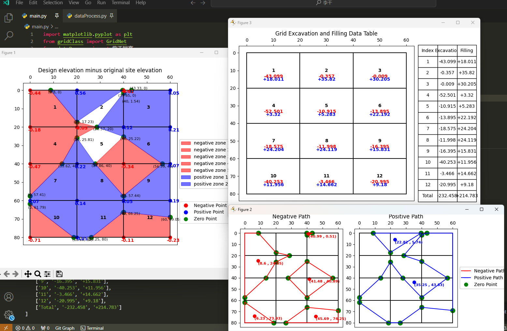
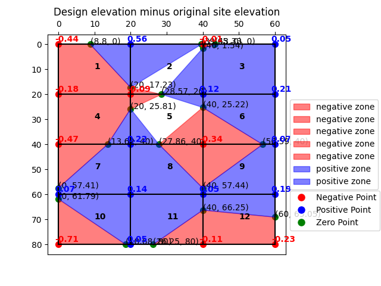
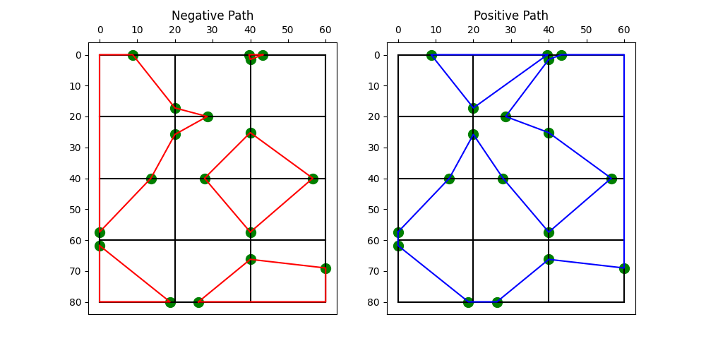
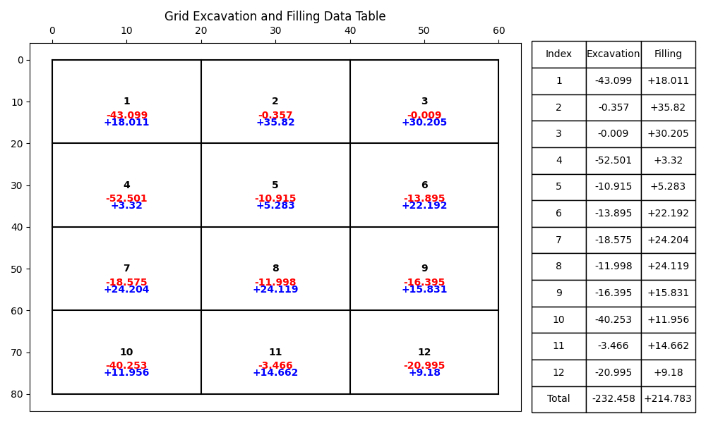
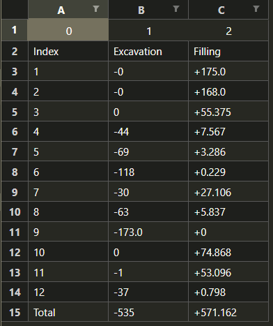

## 方格网法计算土方工程量与可视化的脚本

### 使用说明

- 调整`dataProcess.py`中的网格和标高数据

- 运行`main.py`即可得到土方工程量的计算结果和三个图

- 计算数据和出图会输出在`main.py`同级目录的data文件夹下



#### dataProcess.py 输入数据格式说明

调整`dataProcess.py`中的网格和标高数据，网格数据data格式如下：

```python
#二维数组，每个元素为一个网格的角点的原场地标高
# 坐标系
#左上角为原点。坐标为（0，0）
# ---->x 从左往右为 x 
# |
# |
# |
# y
# 从上往下为 y
data = [
        [-0.44, -0.18, -0.47, 0.07, -0.71],
        [0.56, -0.09,  0.22,  0.14, 0.05],
        [-0.01, 0.12, -0.34,  0.05, -0.11],
        [0.05,  0.21,   0.07,  0.19, -0.23],
    ]
```

其他参数设置如下：

```python
# 纵坡 从上往下下降坡度
slope = 0.03  # m/m ly 0.3%
# 横坡 从左往右下降坡度
cross_slope = 0.0025  # m/m lx 0.25%
# 网格边长
lenth_net = 20  # m
# 拟平整场地后的最高点坐标 ， 根据坡度下降方向和坡面的形状确定
center_point = (0, 0)  # y x 如果从左往右下降坡度，从上往下下降坡度那么最高点在左上角
```
### 出图和数据示例

**数据会输出在同级目录的data文件夹下**

#### 挖填示意图 ，data\ExcavationAndFillingZone.png

#### 边界路径/零点路径 ，data\NegativeAndPositivePath.png

#### 土方工程量，data\DataTable.png


#### 土方工程量统计，data\DataTable.xlsx



**对于非规则场地的方格网，比如“T”形场地,建议是拆分成多个规则的长方形方格网，然后分别计算土方工程量，最后合并计算结果。不然数据处理会很复杂。**